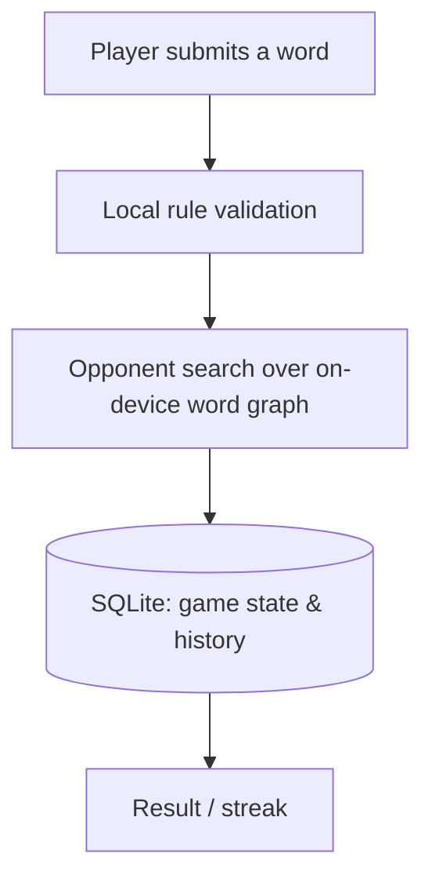

# Borno

🧭 **Type:** iOS game — App Store submission in progress

> No public web URL — case study is prose + architecture diagram.

## Summary

Borno is an offline word-ladder game for iOS. You change one letter at a time to walk from one word to another, racing an opponent that plays against you move for move. The opponent, the dictionary, and your history all live on the device — no account, no network calls, no ads, no tracking.

## Problem

Most mobile word games advertise an "AI opponent" that isn't one — usually a scripted difficulty curve or a delayed replay of another human's game, and it needs a connection and an account to work at all. The result stalls on a plane or a job site, wraps a simple puzzle in ads, and ships your play data somewhere.

## Solution

A real opponent that computes its own moves locally, searching the valid word graph for a path under the same rules the player follows. Difficulty comes from how well it plays, not from a handicap timer. Because the search and the dictionary both run on the device, the whole game works in airplane mode with no account.

## My Role

**Solo builder** — game design, the opponent's move logic, data model, and the full App Store submission.

## Development Approach

Built end to end with Claude Code, including the release pipeline. I directed the judgment calls: the game rules, what makes an opponent feel fair rather than cheap, the difficulty curve, and the decision to stay fully offline with no ads or tracking. Claude Code handled implementation, the SQLite persistence layer, test coverage, and the EAS build and submission mechanics. I reviewed everything before it shipped.

## Key Features

- Offline word-ladder duel against a locally-computed opponent
- Fully playable with no network connection and no account
- No ads, no analytics, no tracking
- Local game history and streak tracking

## Tech Stack

- **App:** Expo (React Native), TypeScript (strict)
- **Local storage:** SQLite
- **Build & release:** EAS Build → TestFlight → App Store

## Architecture Overview

> Illustrative pattern — no server in the loop; every step runs on the phone.

## Status

**App Store submission in progress** — built, submitted, and awaiting review. Private repo.

---

[← Back to portfolio index](../README.md)
