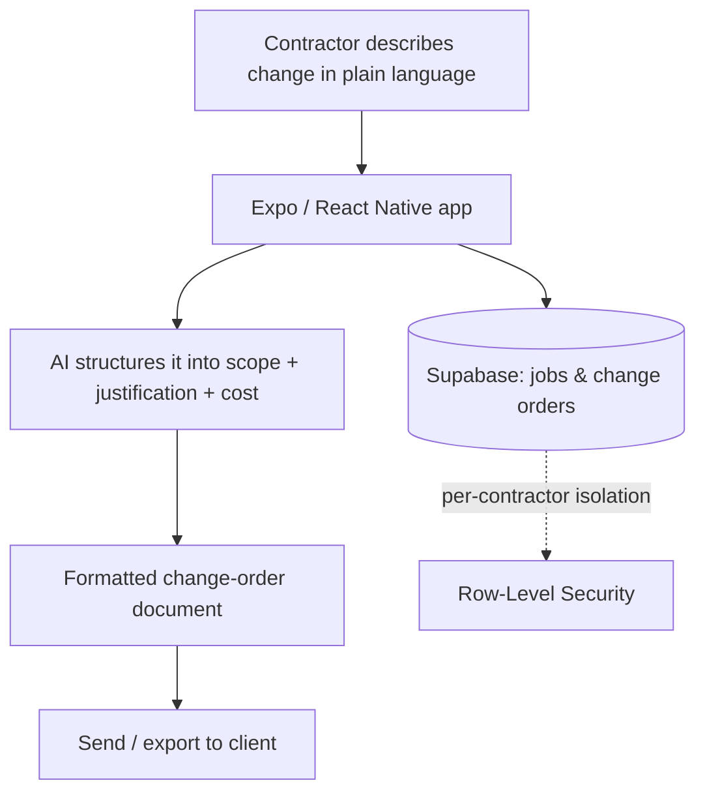

# ChangeOrderAI

**AI-generated change-order documents for trade contractors.**

🧭 **Type:** Mobile app (Expo) — in development
🛠 **Role:** Sole designer, engineer, and operator

> No public web URL yet — this case study is prose + architecture diagram only.

---

## Problem

On a job site, a change order is where money is won or lost — and it's almost always handled badly. A worker notices out-of-scope work, but writing it up properly (clear scope, justification, cost) takes time and writing skill that nobody has mid-shift. The result: undocumented work, disputed invoices, lost revenue.

ChangeOrderAI lets a contractor describe the change in plain language and get back a **professional, structured change-order document** ready to send.

## My role

Sole owner: product design, mobile architecture, the AI document-generation flow, and the data model for jobs and change orders.

## Stack

| Layer | Choice |
|---|---|
| Framework | Expo (React Native) |
| Language | TypeScript (strict) |
| Backend | Supabase (planned: Postgres + Row-Level Security) |

## Architecture

> Illustrative pattern — not real infrastructure.

The core bet: **lower the effort of documenting a change to near zero**, so contractors actually do it — and capture revenue they were losing.

## Key decisions

- **Plain-language input, structured output.** The contractor shouldn't have to know what a well-formed change order looks like — the app does. AI does the structuring; the human supplies the facts.
- **Tenant isolation from the start.** Each contractor's jobs and change orders are isolated via row-level security — the same secure-by-default multi-tenant pattern I use across the studio.
- **Mobile-first, field-realistic.** This gets used on a phone, in work gloves, on a noisy site. The interaction has to survive that context.

## Outcome

- In active development.
- Core flow defined: plain-language input → AI-structured change-order document, on a tenant-isolated data model built for field use.

---

[← Back to portfolio index](../README.md)
