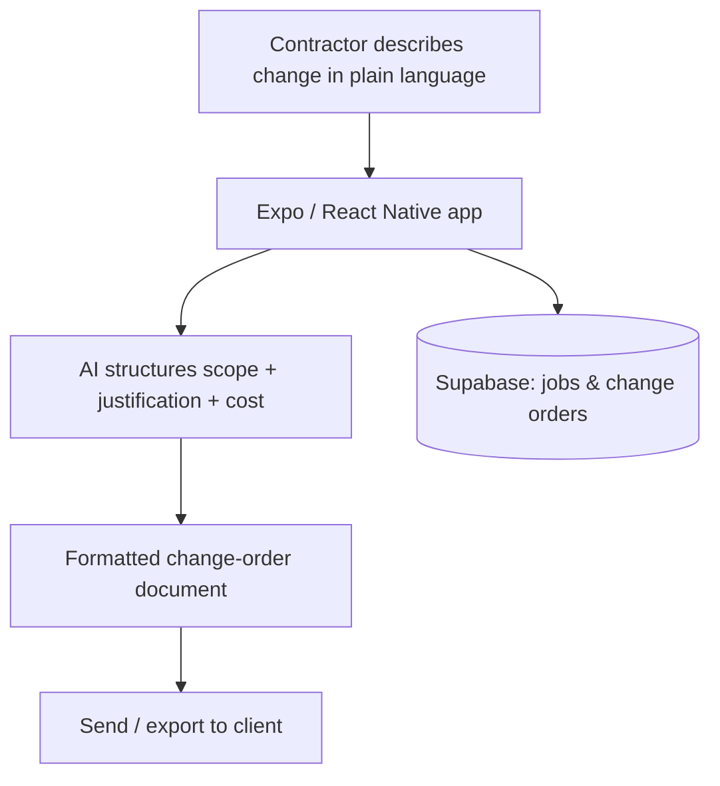

# ChangeOrderAI

🧭 **Type:** Mobile app (Expo) — in progress

> No public demo URL yet — case study is prose + architecture diagram.

## Summary

ChangeOrderAI lets a trade contractor describe an out-of-scope change in plain language on a job site and get back a professional, structured change-order document ready to send. It turns the messiest, highest-stakes piece of field paperwork into a few spoken or typed sentences.

## Problem

On a job site, a change order is where money is won or lost — and it's almost always handled badly. A worker notices out-of-scope work, but writing it up properly (clear scope, justification, cost) takes time and writing skill nobody has mid-shift. The result is undocumented work and disputed invoices.

## Solution

A mobile app where the contractor describes the change in plain language; AI structures it into scope, justification, and cost; and the app produces a formatted change-order document to send or export. Each contractor's jobs and change orders live on an isolated data model.

## My Role

**Solo builder** — product design, architecture direction, AI-assisted implementation, deployment, and operations.

## Development Approach

Built with an AI-assisted workflow using Claude Code / Codex. I bring the construction domain knowledge — what a defensible change order actually needs — and direct the architecture and AI document-generation flow; AI tools accelerate the build.

## Key Features

- Plain-language input → structured change-order document
- Job and change-order records per contractor
- Mobile-first, built for use on-site
- Export / send the finished document to the client

## AI / Automation Features

- AI structuring of plain-language input into scope + justification + cost *(core flow)*
- Document generation into a professional, sendable format *(core flow)*
- Suggested pricing / templates from prior change orders *(planned)*

## Tech Stack

- **Frontend:** Expo (React Native), TypeScript
- **Backend / DB:** Supabase (Postgres) — planned with Row-Level Security
- **AI:** LLM-based text structuring and document generation

## Architecture Overview

> Illustrative pattern — not real infrastructure.

User action → app → AI service → generated document → saved record → sent to client.

## Safety / Security / Compliance Notes

No proprietary source or customer data is reproduced here. The data model is designed so each contractor's jobs and change orders are isolated.

## Business Value

- Designed to reduce the manual effort of documenting change orders to near zero
- Designed to help contractors capture revenue they were losing to undocumented work
- Designed to standardize change-order quality across a crew

## What I Learned

The hard part isn't the AI — it's encoding what makes a change order *defensible* in the trades. Domain knowledge is the moat; the AI is the accelerator.

## Status

**In progress** — active development. Private production repo; sanitized public demo planned.

## Next Improvements

- Pricing suggestions from historical change orders
- Photo attachments as supporting evidence
- Client e-signature / approval flow

---

[← Back to portfolio index](../README.md)
