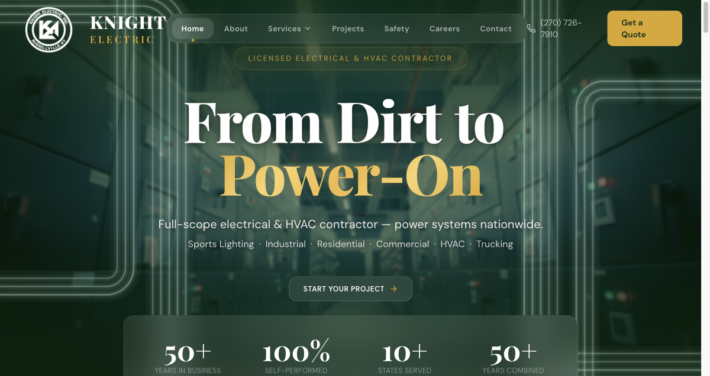
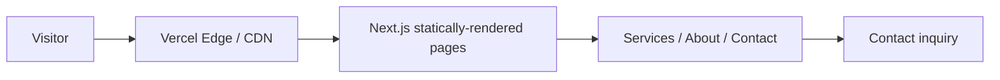

# Knight Electric

**Corporate website rebuild for an electrical contractor.**

🔗 **Live:** [knightelectric.net](https://knightelectric.net)
🧭 **Type:** Marketing website
🛠 **Role:** Designer & front-end engineer

---

## Problem

An established electrical contractor needed a web presence that matched the quality of their field work: fast, credible, mobile-first, and easy to maintain. The goal was a site that converts visitors into inquiries and reads as a serious, modern company — not a dated template.

## My role

I handled design and front-end engineering: layout, responsive behavior, performance, and content structure — translating a contractor's brand into a clean, professional site.

## Stack

| Layer | Choice |
|---|---|
| Framework | Next.js |
| Styling | Tailwind CSS |
| Hosting | Vercel |

## Architecture

> Illustrative pattern — a statically-rendered marketing site.

A marketing site's job is to be **fast and trustworthy**. Static rendering at the edge keeps it instant on a phone in the field, with no server to maintain.

## Key decisions

- **Mobile-first.** The audience finds contractors on a phone. Every layout decision started at 375px width and scaled up.
- **Static rendering at the edge.** No database, no server state, no attack surface to speak of — pages render statically and serve from a CDN. The right tool for the job, and cheap to run.
- **Clarity over cleverness.** Services, credibility, and a clear path to contact — structured so a prospect gets what they need in seconds.

## Outcome

- Live in production at [knightelectric.net](https://knightelectric.net).
- Statically rendered and served from the edge for near-instant loads on mobile.
- Clear, mobile-first presentation of services and credibility with a direct path to inquiry.

## Screenshots

---

[← Back to portfolio index](../README.md)
