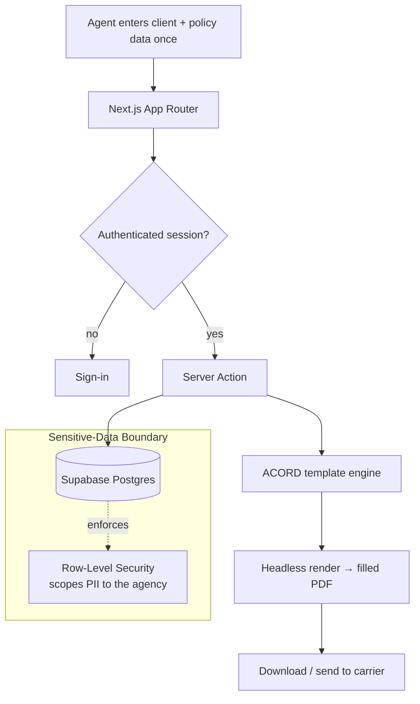

# PolicyPilot

**Insurance-agency CRM with automated ACORD form fill.**

🔗 **Live:** [policypilot-one.vercel.app](https://policypilot-one.vercel.app)
🧭 **Type:** Web SaaS — handles sensitive client data (PII)
🛠 **Role:** Sole designer, engineer, and operator

---

## Problem

Insurance agencies run on **ACORD forms** — the standardized documents that move a policy from submission to binding. The work is repetitive, error-prone, and built on **highly sensitive personal data**: names, addresses, dates of birth, and financial details flowing between applicant, agency, and carrier.

Agencies re-key the same client information across form after form. That wastes hours, introduces transcription errors, and — most importantly for anyone thinking about compliance — **scatters personal data across documents with no consistent control over who can see what.**

PolicyPilot's goal: capture client and policy data once, **auto-fill ACORD forms from it**, and keep that sensitive data under tight, auditable access control the whole way through.

## My role

I own the product end to end — data model, the document-automation pipeline, the security model around PII, the UI, and operations. Every decision below was mine.

## Stack

| Layer | Choice |
|---|---|
| Framework | Next.js (App Router) |
| Database & auth | Supabase (Postgres) |
| Access control | Postgres **Row-Level Security** |
| Type-safe data layer | Drizzle ORM |
| Document generation | Headless browser rendering (Puppeteer) → filled PDF forms |
| UI | Tailwind CSS + shadcn/ui |
| Hosting | Vercel |

## Architecture

> Illustrative pattern — not real deployment topology.

The principle: **client PII is entered once, lives behind a database-enforced access boundary, and flows into forms through a controlled pipeline — never copy-pasted across documents by hand.**

## Key decisions

- **Treat PII as the highest-value asset in the system.** This is the case study most relevant to a privacy/GRC role. Personal and financial data is scoped at the database layer with row-level security, so access is enforced by Postgres itself — not by hopeful checks in application code.
- **Enter once, reuse everywhere — under control.** A single authoritative record drives every form. That kills transcription errors *and* gives one place to govern, retain, and (when needed) delete a client's data — the data-minimization and lifecycle thinking privacy frameworks require.
- **Drizzle for a type-safe data layer.** End-to-end types from schema to query mean the shape of sensitive data is enforced at compile time, closing off a class of data-handling bugs before they ship.
- **Headless rendering for pixel-accurate ACORD output.** Carriers expect the real, exact forms. Rendering through a headless browser produces faithful, fillable PDFs instead of fragile hand-built approximations.

## Outcome

- Live at [policypilot-one.vercel.app](https://policypilot-one.vercel.app).
- Captures client and policy data once and auto-fills standardized ACORD forms from it.
- Sensitive personal data is scoped to each agency through database-enforced row-level security, with a single authoritative record per client for clean governance and retention.

## Screenshots

---

[← Back to portfolio index](../README.md)
