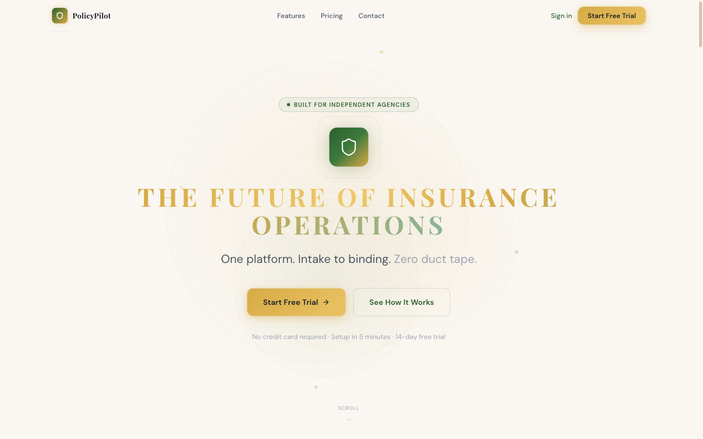
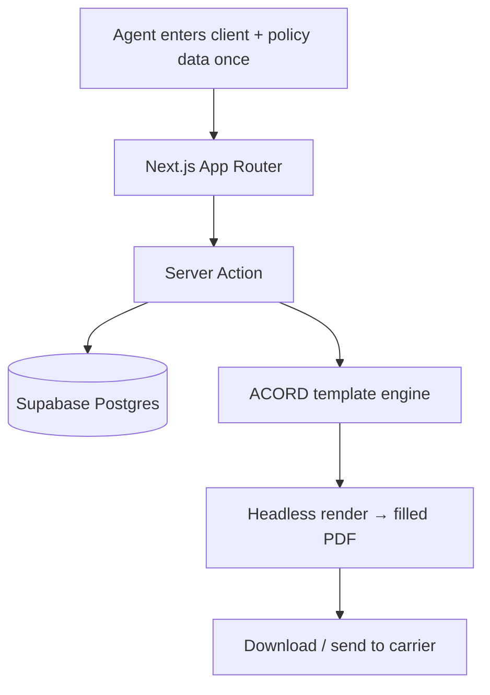

# PolicyPilot

🔗 **Live demo:** [policypilot-one.vercel.app](https://policypilot-one.vercel.app)

## Summary

PolicyPilot is a document-automation tool for insurance agencies. Agencies live on **ACORD forms** — the standardized paperwork that moves a policy from submission to binding — and re-key the same client and policy information across form after form. PolicyPilot captures that data once and **auto-fills the ACORD forms from it**, turning repetitive manual paperwork into a generated document.

## Problem

Insurance agencies re-enter the same information across many standardized forms by hand. It's slow, error-prone, and scattered — the same data retyped into document after document, with transcription mistakes creeping in along the way.

## Solution

A web app where an agent enters client and policy data once, and the system generates filled, carrier-ready ACORD PDFs from it through a controlled document-automation pipeline. One authoritative record drives every form.

## My Role

**Solo product owner and AI-assisted implementation builder** — product design, architecture direction, AI-assisted implementation, deployment, and operations.

## Development Approach

Built with an AI-assisted workflow using Claude Code / Codex. I owned the data model, the form-automation pipeline, and the type-safe data layer; AI tools accelerated implementation and refactoring.

## Key Features

- Enter client and policy data once, reuse across all forms
- Automated ACORD form generation into carrier-ready PDFs
- One authoritative record per client, reducing re-keying and transcription errors
- Type-safe data layer end to end

## AI / Automation Features

- Document automation: structured data → filled, pixel-accurate ACORD PDFs *(live)*
- Workflow automation: a single record drives every downstream form *(live)*
- AI-assisted intake / data extraction from submitted documents *(planned)*

## Tech Stack

- **Frontend:** Next.js (App Router), Tailwind CSS, shadcn/ui
- **Backend / DB:** Supabase (Postgres), Drizzle ORM (type-safe data layer)
- **Document generation:** headless browser rendering (Puppeteer) → filled PDF forms
- **Deployment:** Vercel

## Architecture Overview

> Illustrative pattern — not real deployment topology.

User action → API route → database → document-generation pipeline → filled PDF → saved/sent.

## Safety / Security / Compliance Notes

No proprietary source, customer data, or internal infrastructure detail is reproduced here. The app handles sensitive client information, so it's designed with database-enforced access control (Row-Level Security) scoping data to each agency, and a single authoritative record per client for clean data handling.

## Business Value

- Designed to reduce manual documentation and data-entry time
- Designed to cut transcription errors by sourcing every form from one record
- Designed to standardize the submission-to-binding paperwork workflow

## What I Learned

Faithful document output matters as much as the data model — carriers expect the exact, real forms, so rendering accurate fillable PDFs (rather than approximations) was central. I also learned how a single-source-of-truth record simplifies an entire downstream workflow.

## Status

**Live (demo)** — at [policypilot-one.vercel.app](https://policypilot-one.vercel.app). Private production repo; sanitized public demo planned.

## Next Improvements

- AI-assisted intake to extract data from submitted documents
- Support for additional form types beyond the initial ACORD set
- Carrier-specific output templates

## Screenshots / Demo

-  — product homepage
- Coming soon: data-entry → form-generation workflow screenshot
- Coming soon: generated ACORD PDF preview
- Coming soon: 1–2 minute demo video

---

[← Back to portfolio index](../README.md)
