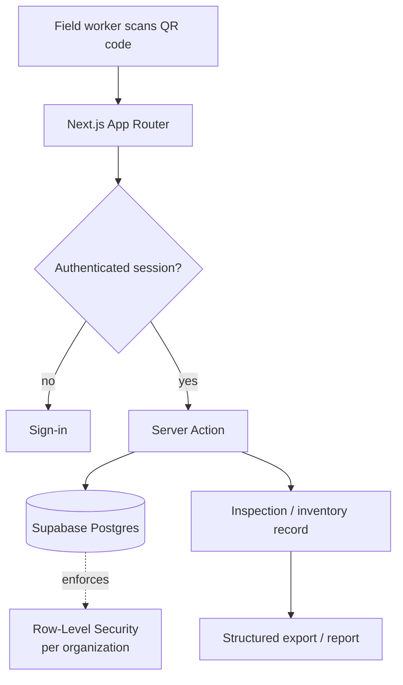

# QRSafePro / QRStock

🔗 **Live:** [qrsafepro.com](https://qrsafepro.com)

## Summary

QRSafePro is a QR-driven platform that automates safety inspections and inventory tracking for field teams in construction and field operations. Scanning a QR code on a piece of equipment or a location *is* the workflow — it pulls up the right form, records who did what and when, and keeps an attributable, exportable record. QRStock is the inventory side, tracking materials and tools as they move between sites.

## Problem

Field-heavy operations run safety inspections and track equipment on paper, spreadsheets, or memory. That means no reliable record of when an inspection happened or what it found, equipment drifting between sites with no system of record, and reporting that's painful to pull together when someone asks for it.

## Solution

A web platform where a QR scan resolves to an asset, opens the correct inspection or inventory action, and writes an attributable record. Each organization's data is isolated, and everything is exportable for reporting and audit readiness.

## My Role

**Solo product owner and AI-assisted implementation builder** — product design, architecture direction, AI-assisted implementation, deployment, and operations.

## Development Approach

Built with an AI-assisted workflow using Claude Code / Codex. I owned the data model, the multi-tenant security design, and the field-first UX decisions; AI tools accelerated implementation and refactoring.

## Key Features

- QR scan as the primary interaction — point a phone, get the right form
- Safety inspection capture with attributable records (who / what / when)
- Inventory tracking for materials and equipment across sites (QRStock)
- Multi-tenant: each organization's data is isolated
- Structured export for reporting

## AI / Automation Features

- Workflow automation: a scan routes directly to the correct action, removing manual lookup *(live)*
- AI-assisted summaries and report generation for inspection data *(planned)*

## Tech Stack

- **Frontend:** Next.js (App Router, Server Components), Tailwind CSS, shadcn/ui
- **Backend / DB:** Supabase (Postgres)
- **Access control:** Postgres Row-Level Security
- **Deployment:** Vercel

## Architecture Overview

> Illustrative pattern — not real deployment topology.

User action → API route → database (tenant-scoped) → saved record → exportable report.

## Safety / Security / Compliance Notes

No proprietary source, customer data, or internal infrastructure detail is reproduced here. In the product, tenant isolation is enforced at the database layer with Row-Level Security, and tenant context is resolved server-side from the authenticated session rather than trusted from client input.

## Business Value

- Designed to make field reporting easier and faster than paper or spreadsheets
- Designed to create clearer, attributable safety and inspection records
- Designed to improve audit readiness through consistent, exportable records
- Designed to standardize inventory tracking across multiple sites

## What I Learned

Enforcing multi-tenant isolation at the database layer (rather than in application code) is the decision that matters most in this kind of product. I also learned how much field-tool adoption depends on collapsing the workflow to a single action — a scan — instead of a form.

## Status

**Live / active** — in production at [qrsafepro.com](https://qrsafepro.com). Private production repo; sanitized public demo planned.

## Next Improvements

- AI-assisted inspection summaries and report generation
- Offline-first capture for low-connectivity sites
- Richer analytics on inspection trends

---

[← Back to portfolio index](../README.md)
