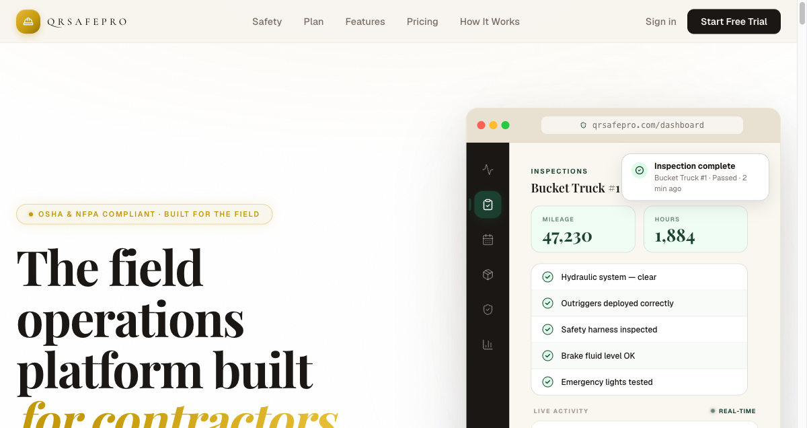
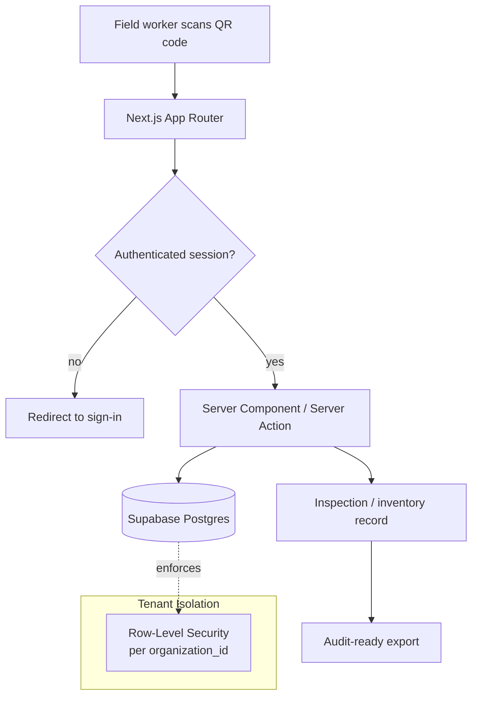

# QRSafePro / QRStock

**QR-driven safety inspections and inventory management for field teams.**

🔗 **Live:** [qrsafepro.com](https://qrsafepro.com)
🧭 **Type:** Multi-tenant web SaaS
🛠 **Role:** Sole designer, engineer, and operator

---

## Problem

Field-heavy operations — construction, electrical, facilities — run safety inspections and track equipment on paper, spreadsheets, or memory. That creates three failures that map directly onto compliance risk:

1. **No reliable audit trail.** When an inspection happened, who did it, and what they found is unverifiable after the fact.
2. **Equipment and inventory drift.** Tools and materials move between sites with no system of record.
3. **No tenant separation.** Off-the-shelf tools mix one company's data with another's, or force everything into a single shared bucket.

The job needed a system where **scanning a QR code is the entire workflow** — and where every record is attributable, isolated per organization, and exportable for an audit.

## My role

I owned the product end to end: information architecture, data model, security model, UI, and operations. There was no team — every decision below was mine to make and live with.

## Stack

| Layer | Choice |
|---|---|
| Framework | Next.js (App Router, Server Components) |
| Database & auth | Supabase (Postgres) |
| Access control | Postgres **Row-Level Security** on every table |
| UI | Tailwind CSS + shadcn/ui |
| Hosting | Vercel |

## Architecture

> Illustrative pattern — not real deployment topology.

The core principle: **a QR scan resolves to an asset, the asset belongs to exactly one organization, and the database — not the application layer — enforces who can see it.**

## Key decisions

- **RLS as the security boundary, not application code.** Tenant isolation lives in the database with row-level security keyed to the organization. Even a bug in the app layer can't leak one tenant's records to another, because the database refuses the query. This is the single most important design choice in a multi-tenant product — and the one most directly relevant to a privacy/GRC reviewer.
- **Derive tenant context server-side, never trust the client.** The organization a request operates within is resolved from the authenticated session and the resource being accessed — never read from a request body or URL parameter a user could tamper with.
- **Scan-first UX.** The primary interaction is pointing a phone at a code. Everything else (forms, history, exports) hangs off that single action, so adoption doesn't depend on training.
- **Export built in from day one.** If you can't get the records out cleanly, you don't have an audit trail. Structured export was a launch requirement, not a later add-on.

## Outcome

- Live in production at [qrsafepro.com](https://qrsafepro.com).
- Multi-tenant architecture deployed and serving active organizations, each with fully isolated data.
- Inspections and inventory movements are logged with an attributable, audit-ready trail and clean structured export.
- Runs on serverless, edge-rendered infrastructure for fast loads on field devices with no servers to maintain.

## Screenshots

---

[← Back to portfolio index](../README.md)
