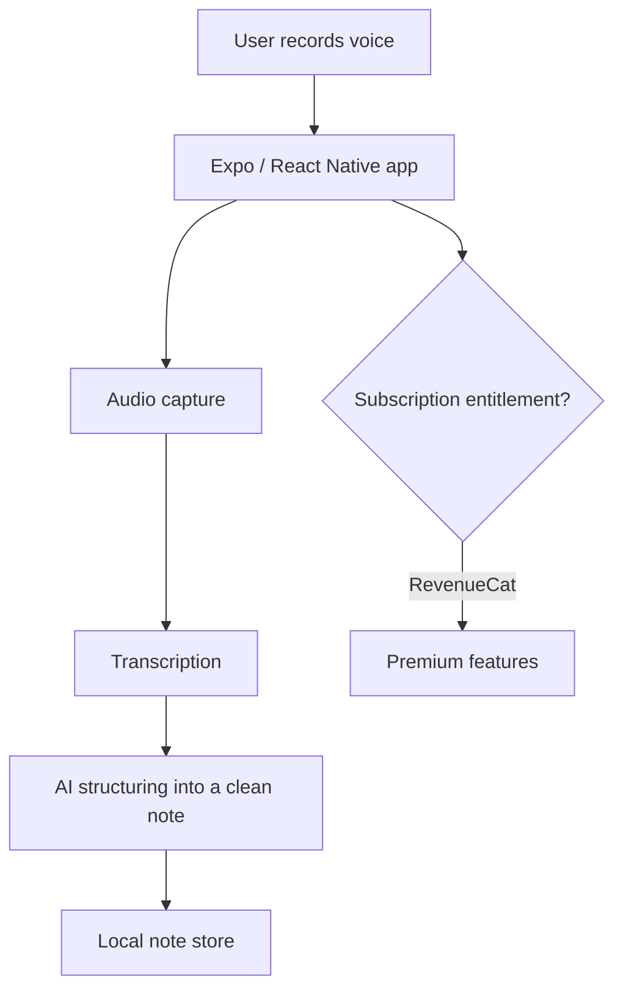

# VoicePencil

🧭 **Type:** Mobile app (iOS) — App Store submission in progress

> No public web URL — case study is prose + architecture diagram. Screenshots omitted to avoid reproducing in-app content.

## Summary

VoicePencil is an iOS app that turns spoken input into clean, structured, useful notes — not just a raw transcript. It's a focused piece of document-automation: capture by voice, and let AI do the work of organizing it into something worth keeping.

## Problem

Capturing a thought by voice is fast; turning it into an organized, searchable note is not. Most voice apps stop at a raw transcript and leave the structuring to you.

## Solution

A mobile app with a pipeline that takes audio, transcribes it, and uses AI to structure the result into a clean note — wrapped in a subscription model that gates premium capability.

## My Role

**Solo product owner and AI-assisted implementation builder** — UX, mobile architecture, the AI transcription/structuring pipeline, subscription billing, and release operations.

## Development Approach

Built with an AI-assisted workflow using Claude Code / Codex on Expo's New Architecture. I directed the product and the audio → AI → storage pipeline; AI tools accelerated implementation and debugging.

## Key Features

- Voice capture → transcription → structured note
- Subscription entitlements (premium features)
- Built on Expo SDK 54 (New Architecture)

## AI / Automation Features

- AI structuring of transcripts into organized notes *(core flow)*
- Voice-to-text transcription pipeline *(core flow)*
- Smart categorization / templates by note type *(in progress)*

## Tech Stack

- **Frontend:** Expo SDK 54 (React Native, New Architecture), TypeScript (strict)
- **Subscriptions:** RevenueCat
- **Build & release:** EAS Build → TestFlight

## Architecture Overview

> Illustrative pattern — not real infrastructure.

User action → capture → transcription → AI structuring → saved note.

## Safety / Security / Compliance Notes

No proprietary source or user data is reproduced here. Voice and transcript data are handled with care for what's retained and where it lives — a deliberate design constraint given the sensitivity of voice input.

## Business Value

- Designed to make voice capture genuinely useful, not just a transcript
- Designed to reduce the effort of turning a thought into an organized note

## What I Learned

The product value is entirely in the *structuring* step — the gap between a transcript and a note someone actually keeps. I also got hands-on with the real-world edge cases of subscription state (renewals, refunds, restores) via RevenueCat.

## Status

**App Store submission in progress.** Private production repo.

## Next Improvements

- Smarter categorization by note type
- Search across notes

## Screenshots / Demo

- Coming soon: voice-capture screen (mobile / field view)
- Coming soon: AI structuring — transcript → organized note
- Coming soon: 1–2 minute demo video

---

[← Back to portfolio index](../README.md)
