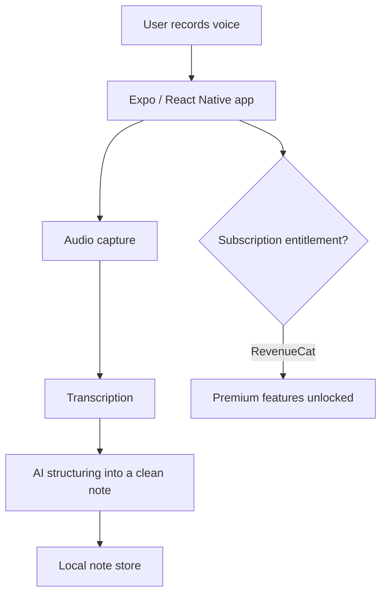

# VoicePencil

**AI voice-to-text notes app for iOS.**

🧭 **Type:** Mobile app (iOS) — in TestFlight beta
🛠 **Role:** Sole designer, engineer, and operator

> No public web URL — this case study is prose + architecture diagram only. Screenshots are omitted to avoid reproducing in-app content.

---

## Problem

Capturing a thought by voice is fast; turning it into a clean, organized, searchable note is not. Most voice apps stop at a raw transcript. VoicePencil's goal is to take spoken input and produce **structured, useful notes** — with a subscription model that sustains the product.

## My role

I own the entire product: UX, mobile architecture, the AI transcription/structuring pipeline, subscription billing, and release operations through Apple's pipeline.

## Stack

| Layer | Choice |
|---|---|
| Framework | Expo SDK 54 (React Native, New Architecture) |
| Language | TypeScript (strict) |
| Subscriptions | RevenueCat |
| Build & release | EAS Build → TestFlight |

## Architecture

> Illustrative pattern — not real infrastructure.

The interesting work is the **pipeline from raw audio to a note a person actually wants to keep**, plus a subscription layer that gates premium capability cleanly.

## Key decisions

- **Expo's New Architecture (SDK 54).** Bridgeless, modern React Native — better performance and a maintainable path forward versus bare RN.
- **TypeScript strict, no `any`.** Type safety across the audio → AI → storage pipeline catches whole classes of bugs before they ship to a phone I can't hot-fix.
- **RevenueCat for billing.** Subscription state across App Store edge cases (renewals, refunds, restores) is genuinely hard; RevenueCat owns that complexity so I don't reinvent receipt validation.
- **Privacy of voice data is a first-class concern.** Voice is sensitive personal data. Minimizing what's retained and being deliberate about where audio and transcripts live is a design constraint, not a footnote — exactly the privacy-by-design thinking I'm carrying into GRC work.

## Outcome

- In **TestFlight** beta, progressing toward App Store launch.
- Built on Expo's New Architecture with a working voice → transcription → structured-note pipeline and live subscription entitlements.

---

[← Back to portfolio index](../README.md)
